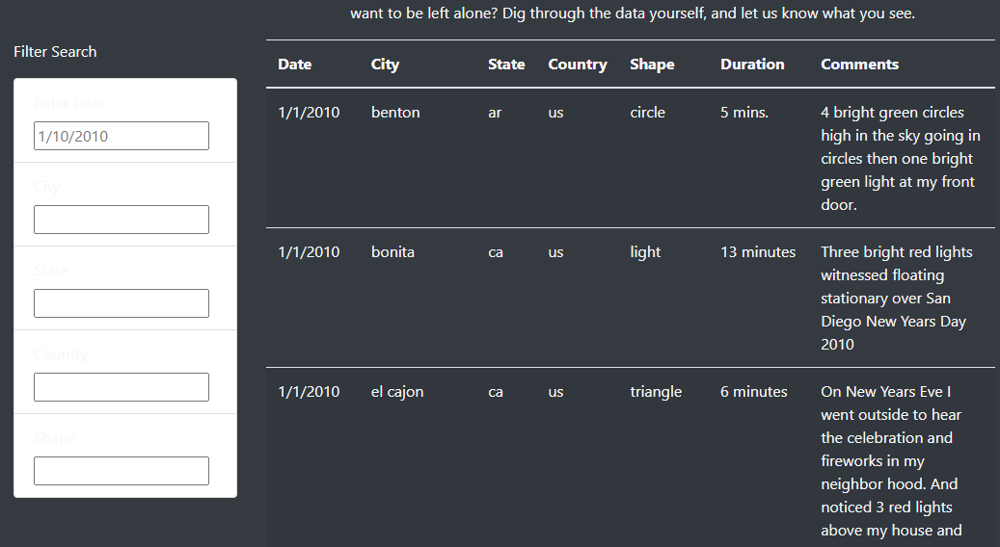
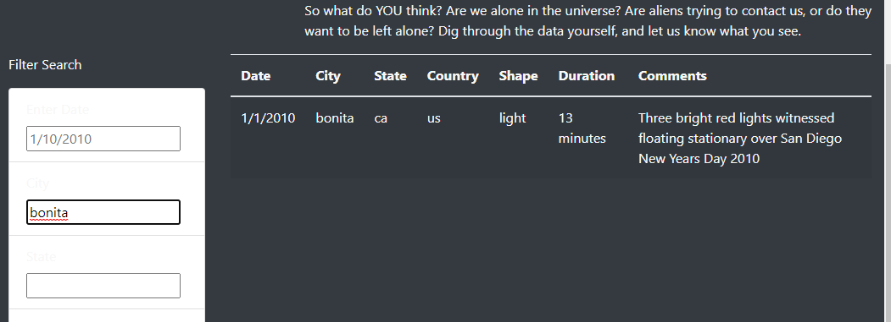
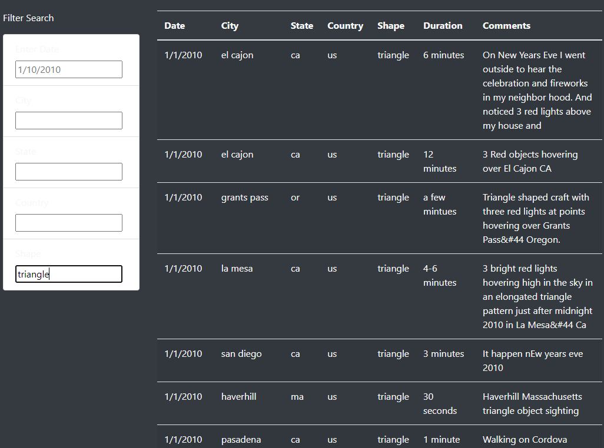
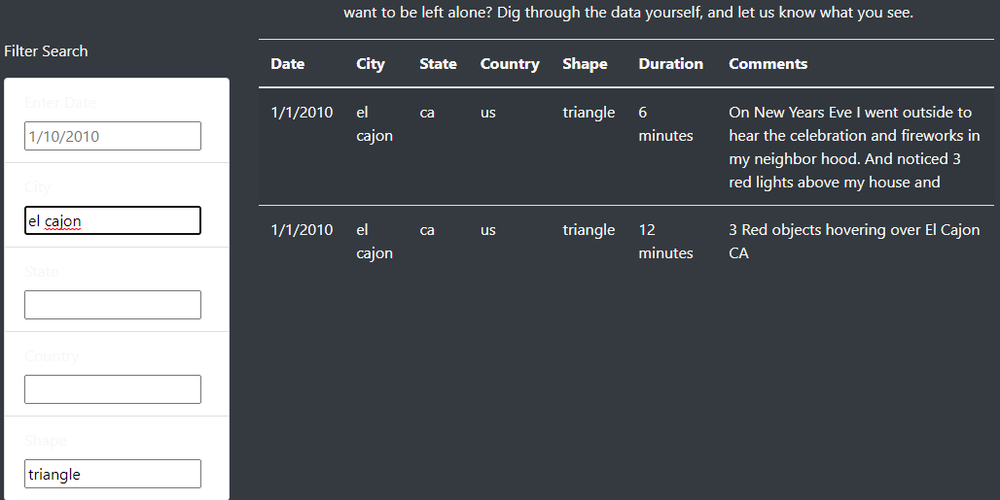

# 11.UFOs

## Resources
JavaScript 1.7

## Overview

The core of this project is a website that not only displays UFO data, but also allows that data to be filtered on multiple criteria.  

## Results

The website defaults to a single date field filled in, in this case 1/10/2010 as in Figure 1

[Fig1: Clear Filters](other_resources/01_Fig1_Clear_Filters.png?raw=true "Figure 1: Clear Filters")
The website defaults to a single date field filled in, in this case 1/10/2010 as in Figure 1.  

[Fig2: Filtered for City](other_resources/02_Fig2_Filtered_for_City.png?raw=true "Figure 2: Filtered for City")

Enter a city, as in Figure 2, and click enter.  The website will filter down to display only that city, if it exists in the dataset.

[Fig3: Filtered for Shape](other_resources/03_Fig3_Filtered_for_shape.png?raw=true "Figure 3: Filtered for Shape")

Alternatively, one can filter for shape as in Figure 3.

[Fig4: Filtered for Shape and City](other_resources/04_Fig4_Filtered_for_shape_and_city.png?raw=true "Figure 4: Filtered for Shape and City")

Figure 4 illustrates a combined filter set of shape and city.  This demonstrates that the filter set will be only those data elements that match all filters.

## Summary

One drawback of this website is that all fields cannot be filtered.    For instance, both Duration and Comments are unfilterable.    Adding a search field for the comments field should be relatively simple.    Processing the duration field would be a bit more difficult, as it would involve some regex algorithm which would likely lose some data.  Another idea for further development would be to add the ability to export search results, into a (for example) csv file.